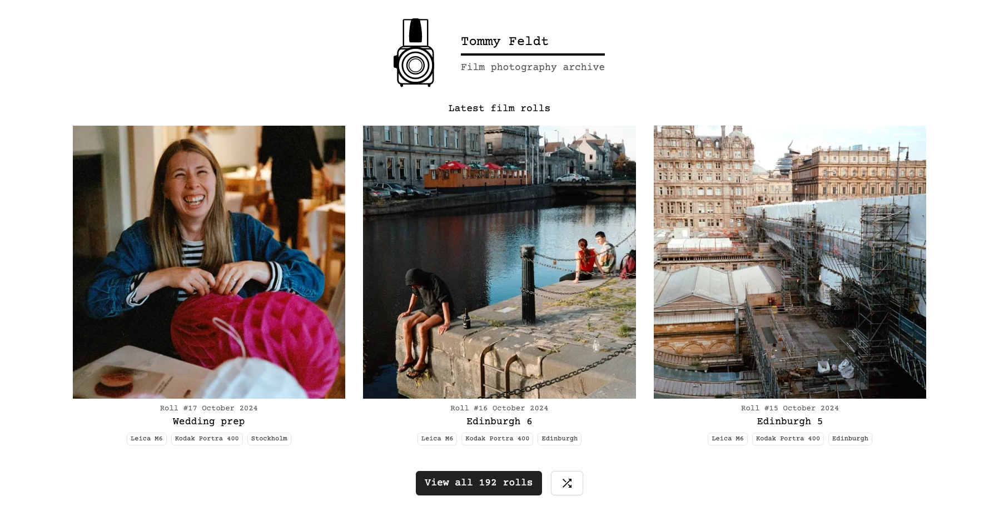
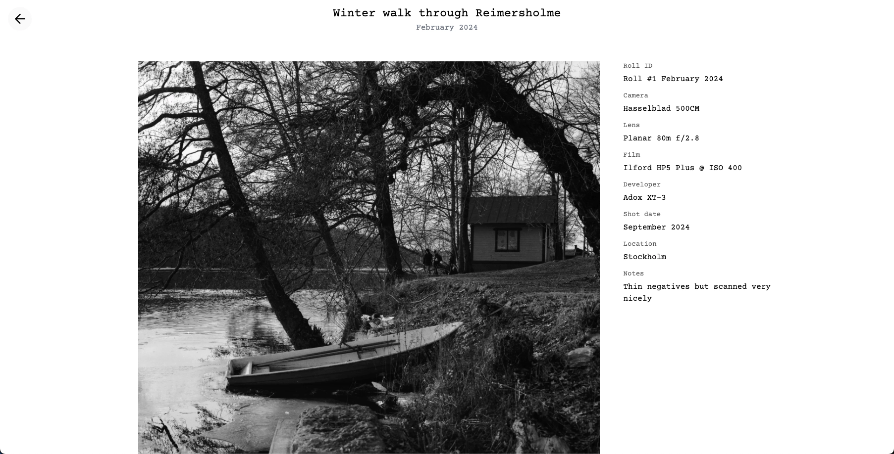
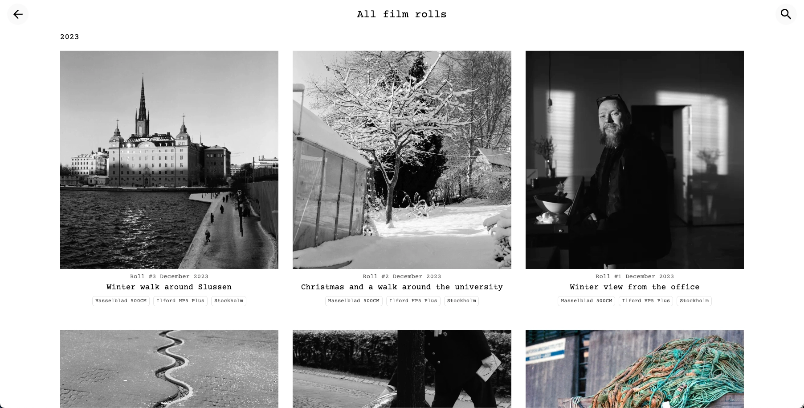
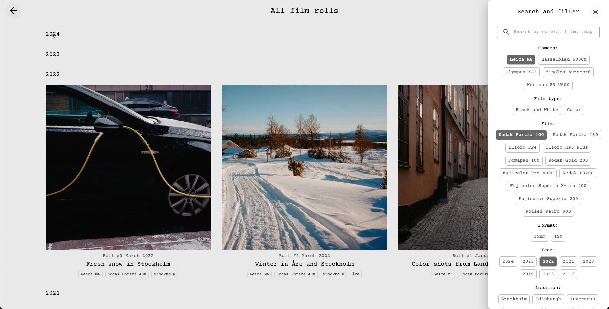
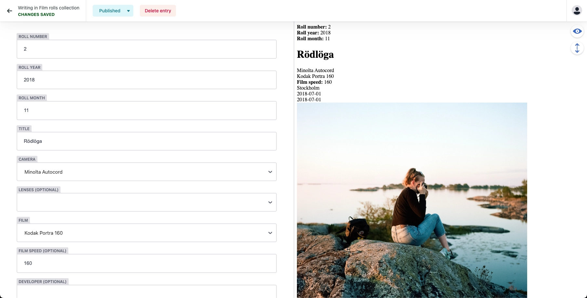

# Film photography archive

An open source film photography portfolio/blog/archive for publishing your film rolls.

> 👉 New to GitHub? Check out the [simplified setup guide](SETUP_SIMPLE.md) to get started without any coding.

## Screenshots
Landing page


Individual film roll page with metadata


List of all rolls


Search and filter


Creating a new roll in Decap CMS



## Features
- Publish your photos roll by roll and showcase highlights
- Powerful search and filters for cameras, films, locations, dates, etc
- Full control over your content and data since it's all stored within the repository
- Fully accessible and WCAG 2.2 compliant ( Note: This requires that you add alt text to all images)
- Light and dark themes
- Intuitive lightbox photo viewer with touch gestures and full-screen mode
- Great performance! (100% on Google Pagespeed insights)
- SEO friendly with structured data, meta descriptions, and auto-generated social sharing images
- Visitor comments (optional)
- Batch import script to generate roll markdown files from folders of photos

## Technologies
- Built as static site with Astro.js
- Styling with Tailwind CSS
- All content stored as markdown files
- Lightweight photo viewer using PhotoSwipe
- PWA compatible and installable to your phone's home screen
- (Optional) Git-based CMS with Decap CMS and access management with Netlify Identity

## FAQ

### How do I add a new roll?
Create a new markdown file in the `src/content/rolls` folder.

The easiest way is to use the Decap CMS UI.

### How are rolls numbered and sorted?
The website currently assumes a format where rolls are numbered per calendar month. An example slug for a roll could be `{year}-{month}-{roll-number}-{roll-name}`. 

This means that if you take photos in October, you should number them 1, 2, 3 etc. If you take photos in November, you should start numbering from 1 again.

In the future, this could be made more flexible.

### How do I add a new camera or film or highlight?
Edit the `global.config.yml` file then run the `setup.js` script to update the CMS config. The CMS will then suggest the new camera and film and highlight in the UI.

```
yarn setup
```

### How is the roll metadata collected and used?
The build process will try to automatically extract the lenses and development notes from the EXIF data in the photo files, and present it on the roll page.

This is assuming that the photos use the **Negative Lab Pro** film EXIF schema from Lightroom.

But you can also manually add the data to the frontmatter of the roll markdown file. If present, this will override the automatically extracted EXIF metadata.

### How do I create a new highlight/feature?
Features are stored as markdown files in the `src/content/features` folder. They can be created manually, via the Decap CMS UI or by running the `setup.js` script.

Content in a feature can be a direct-uploaded image or a specific photo from a roll. 

To add a photo from a roll, just add the name of the feature to the photo in the roll markdown file:

``` src/content/rolls/2024-10-04-first-edinburgh-roll.md
- image: /src/assets/images/202410-004-017.jpg
  alt: Stone wall with street light with Edinburgh castle in the background
  feature: Scotland 
```

### How can I translate the website to my language?
Translations for the UI are managed in the `i18n` folder. Currently only English is supported, but you can easily add your own language.

### How do I use the website as a PWA?
The website is PWA compatible by default and installable to your phone's home screen. 

It does **not** currently use content caching via service workers, but that can easily be enabled. Refer to the [Astro PWA documentation](https://docs.astro.build/en/guides/pwa/) for more information.

To customize the name, icon, theme color, etc, edit the `manifest` object in the `astro.config.mjs` file.

### How do I enable visitor comments?
The website supports visitor comments when hosted on Netlify. Comments are submitted as pull requests to your repository and need to be manually approved.

To enable comments:

1. Set `enable_comments: "on"` in your `global.config.yml` file
2. Make sure that you have a valid `GITHUB_TOKEN` with write access set as a site environment variable in your Netlify dashboard
3. User comments will appear as pull requests in your repository
4. Review and merge the pull requests to publish the comments

Note that comments are stored as markdown files in the `src/content/comments` folder, with the filename format `<roll-slug>-<timestamp>.md`.

### How can I batch import multiple rolls at once?
The `generateRollContent.js` Node script can be used to generate markdown files for multiple rolls at once.

It will read all the photos in all subfolders, copy them to the `src/assets/images` folder and generate a markdown file for each roll, assuming that the folders are named in the format `YYYYMM-<roll-number>`.

It will also try to extract EXIF metadata from the first photo in each roll, which can be used to auto-fill the camera and film fields.

Change the target directory in the script to point to your source folder, then run it:

```
node generateRollContent.js /path/to/source/folder
```


## Get started

1. Clone the repo
2. Run `yarn install` to install the dependencies
3. Edit the `global.config.yml` file to configure your site
4. (Optional) Run `node setup.js` to configure Decap CMS based on your cameras, films, lenses, etc
3. Run `yarn dev` to start the development server
4. (Optional) Run `npx decap-cms` to start the CMS proxy server
5. Add rolls to the `src/content/rolls` folder, either by adding markdown files or using the CMS UI
7. Run `yarn build` to build the project
8. Run `npx astro preview` to preview the project

## Deploying to Netlify
Deploying to Netlify is optional, but it is an easy way to host the website and manage access to the Decap CMS.

1. Create a new site on Netlify and connect it to the repository. It should automatically detect that the build command is `yarn build` and the publish directory is `dist`.
2. Enable the "Identity" service and enable "Git Gateway" for access management.
3. Invite your user to the Identity so that you will be able to log in to the CMS.
4. In **Site configuration → Environment variables**, set **`GITHUB_REPO_OWNER`** and **`GITHUB_REPO_NAME`** (your GitHub username and this repo name). This is required for the Decap CMS image preview to work—see the subsection below for details and for private forks.
5. Click on "Deploy site"
6. The site should now be live! The admin UI should be available at `https://<your-site-name>.netlify.app/admin`.

### Decap CMS: images not showing in the admin preview?

The CMS expects images at `/src/assets/images/photos/`, but the built site doesn’t include that path. A Netlify function proxies those requests from your GitHub repo.

**Set these in Netlify (Site configuration → Environment variables):**

- **`GITHUB_REPO_OWNER`** – your GitHub username (or org)
- **`GITHUB_REPO_NAME`** – this repo’s name (e.g. `film-photography-archive`)

If your fork is **private**, also set **`GITHUB_TOKEN`** to a Personal Access Token with `repo` (or `contents: read`) so the function can fetch images.

Optional: **`GITHUB_BRANCH`** – branch to load images from (default: `main`).

Then trigger a new deploy so the function picks up the variables. After that, image thumbnails and the preview pane in the CMS should work.

### My Netlify build is timing out, now what?

Netlify has a maximum build time of 30 minutes. If you have a lot of images, your Netlify-deployed site might be too large to finish in this time since all images are resized and optimized in the build step. The time limit is usually around 7000 images.

**Note:** The full build only needs to go through once. For subsequent builds, Netlify will only build the changed files and use cached images from previous builds.

There are two ways to work around this:

1. Build locally and deploy the output to Netlify using `npx netlify deploy --prod`

2. (Better option) Temporarily remove some of your rolls from the `src/content/rolls` folder and push to Netlify. Once the build is complete, you can add the rolls back and push again.

# License
This project is licensed under the MIT License. See the [LICENSE](LICENSE) file for details.

All photos in the `src/assets/images/images` folder are created by me (Tommy Feldt) and are free to use under the [Creative Commons CC0 1.0 Universal license](https://creativecommons.org/publicdomain/zero/1.0/).

# Acknowledgements
- The Hasselblad icon is from [The Noun Project](https://thenounproject.com/term/hasselblad/10135/) by [Assiya Dauyek](https://thenounproject.com/creator/adauyek/), used under [Creative Commons Attribution 3.0 License](https://creativecommons.org/licenses/by/3.0/). Modifications were made.
- The photo gallery feature uses the [PhotoSwipe](https://photoswipe.com/) library, which is licensed under the [MIT License](https://github.com/dimsemenov/PhotoSwipe/blob/master/LICENSE).
